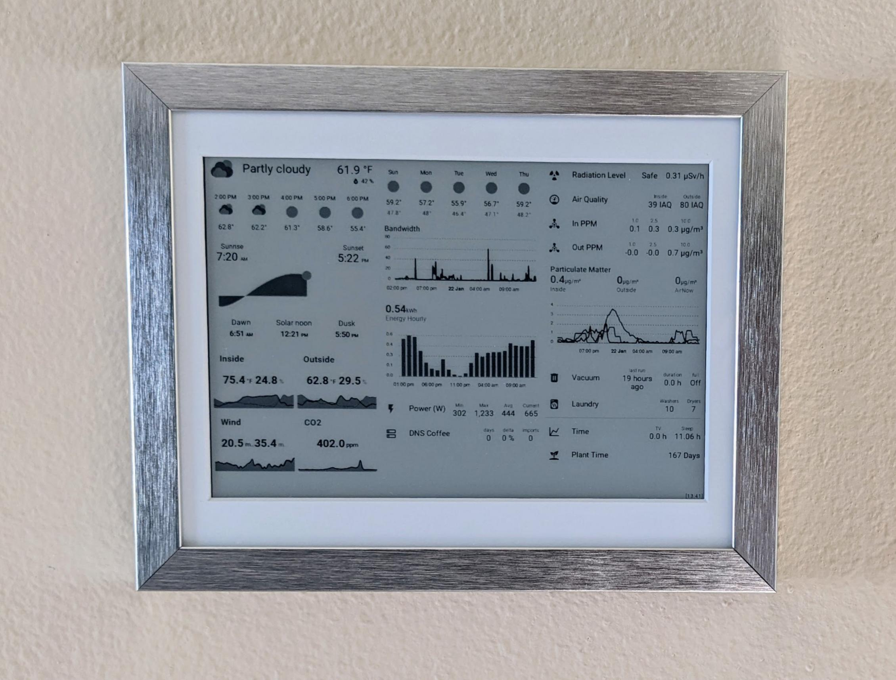

# HomePlate

A [Trmnl](https://trmnl.com/) and [Home Assistant](https://www.home-assistant.io/) E-Ink Dashboard for [Inkplate](https://soldered.com/categories/inkplate/) e-paper boards.

## Supported Boards

* Inkplate 6
* Inkplate 6v2
* Inkplate 6 Plus
* Inkplate 6 Plusv2
* Inkplate 6 Flick
* Inkplate 10
* Inkplate 10v2

## [Activities Screenshots](activities.md)

## Features

* [Trmnl](https://trmnl.com) support
* Display Home Assistant dashboards on a beautiful e-ink display
* Display WiFi QR Codes for guests/friends to connect to home/guest wifi
* Display messages directly from Home Assistant over MQTT
* Makes full use of the ESP32's cores with [FreeRTOS](https://www.freertos.org/)
* Reports sensor data to Home Assistant over MQTT (Temperature, Battery, WiFi, etc.)
* Change activity displayed via MQTT command (HASS dashboard, WiFi QR, Stats, text message, etc.)
* Syncs RTC over NTP
* Touch-pad buttons can start activities and wake from sleep
* 1 month+ battery life!
* Low battery warning displayed and sent over MQTT
* OTA updates over WiFi
* Partial screen updates in grayscale mode.
* Power saving sleep mode.
* Display any image from MQTT command
* Supports PNG, BMP, and JPEG images

## Installation

### Web Installer (recommended)

The easiest way to install HomePlate is using the [Web Installer](https://lanrat.github.io/homeplate/) — no development tools required, just a USB cable and Chrome or Edge. Pre-built firmware is also available on the [Releases](https://github.com/lanrat/homeplate/releases) page.

1. Connect your Inkplate to your computer via USB.
2. Visit the [Web Installer](https://lanrat.github.io/homeplate/) in Chrome or Edge.
3. Select your board variant.
4. Click **Install HomePlate** and select the serial port.

After flashing, the device will create a **HomePlate-Setup** WiFi network for configuration — see the [Setup Guide](setup.md) for next steps.

### PlatformIO (for developers)

If you prefer to build from source, see the [Development Guide](developing.md) for PlatformIO build and flash instructions.

## Setup

### [Quick Start Guide](setup.md)

HomePlate is configured through a WiFi captive portal — no config files required. Flash the firmware, connect to the **HomePlate-Setup** WiFi network, and configure your settings through the web interface.

See [setup.md](setup.md) for detailed setup instructions, settings reference, and timezone configuration.

To change settings later, hold the **wake button** during boot to re-open the config portal.

### [Hardware](hardware.md)

### [Trmnl](trmnl.md)

Set the `TRMNL ID` and `TRMNL Token` in the WiFi setup portal, and set the Default Activity to `Trmnl`.

The [Alias Plugin](https://help.trmnl.com/en/articles/10701448-alias-plugin) can be used to display images from your local network, such as a Home Assistant Dashboard.

See [trmnl.md](trmnl.md) for more information.

### Home Assistant Dashboard

Create a Home Assistant Dashboard you want to display. I recommend using the [kiosk-mode](https://github.com/NemesisRE/kiosk-mode), [card-mod](https://github.com/thomasloven/lovelace-card-mod) and [layout-card](https://github.com/thomasloven/lovelace-layout-card) plugins to customize and tune the dashboard for your display.

Setup the [Screenshot Home Assistant using Puppeteer](https://github.com/balloob/home-assistant-addons/tree/main/puppet) service to create screenshots of the desired dashboards for the HomePlate. This also works with the Trmnl Alias plugin.

See [hass.md](hass.md) and [dashboard.md](dashboard.md) for additional details.

## Upgrading

### Update via Web Installer (recommended)

The simplest way to upgrade is via the [Web Installer](https://lanrat.github.io/homeplate/):

1. Connect your Inkplate to your computer via USB.
2. Visit the [Web Installer](https://lanrat.github.io/homeplate/) in Chrome or Edge.
3. Flash the latest firmware — your settings will be preserved.

### WiFi Manager OTA

You can update the firmware over WiFi without a computer connected, using a firmware `.bin` file from the [Releases](https://github.com/lanrat/homeplate/releases) page:

1. Download the firmware `.bin` for your board from the [Releases](https://github.com/lanrat/homeplate/releases) page.
2. Boot the device into setup mode by holding the **wake button** during boot.
3. Connect to the **HomePlate-Setup** WiFi network.
4. Upload the new firmware through the captive portal's firmware update page.

### PlatformIO

For developers building from source, HomePlate can also be flashed via PlatformIO over USB or OTA. See the [Development Guide](developing.md) for details.

## Development

See the [Development Guide](developing.md) for building from source, PlatformIO setup, debugging, tests, and advanced compile-time configuration.
