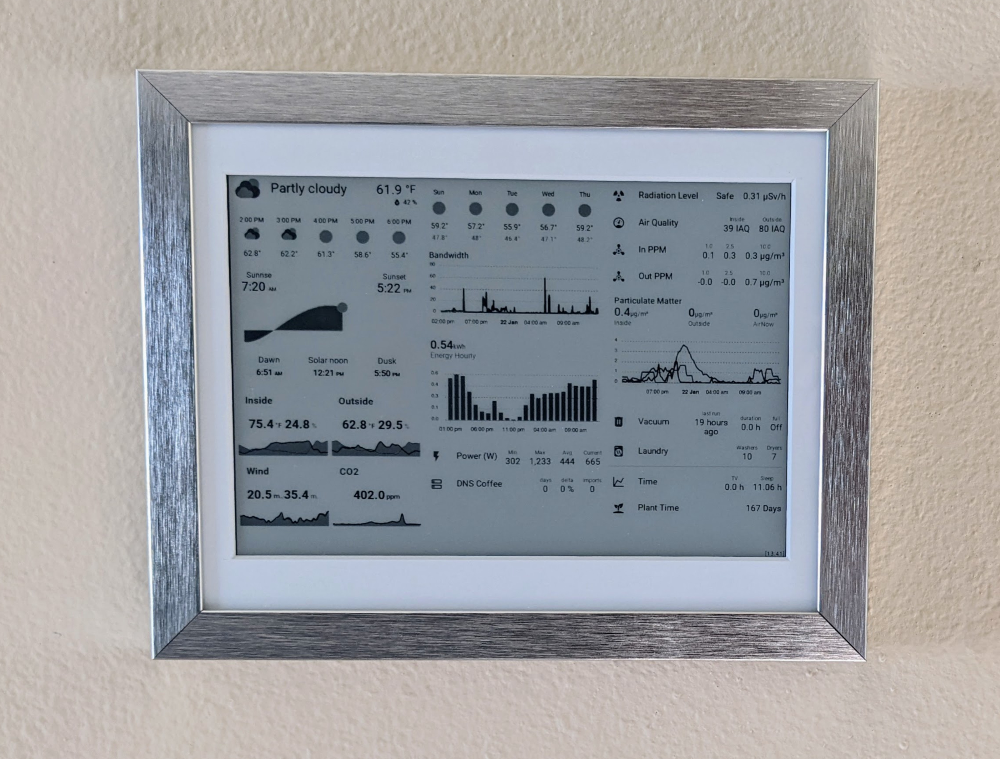

# HomePlate

[Trmnl](https://usetrmnl.com/) and [Home Assistant](https://www.home-assistant.io/) E-Ink Dashboard on the [Inkplate 10](https://soldered.com/product/inkplate-10-9-7-e-paper-board-copy/)



## [Activities Screenshots](activities.md)

## Features

* [Trmnl](https://usetrmnl.com) support
* Display Home Assistant dashboards on a beautiful e-ink display
* Display WiFi QR Codes for guests/friends to connect to home/guest wifi
* Can display messages directly from Home Assistant over MQTT
* Makes full use of the ESP32's cores with [FreeRTOS](https://www.freertos.org/)
* Reports sensor data to Home Assistant over MQTT (Temperature, Battery, WiFi, etc..)
* Can change Activity displayed via MQTT Command (HASS dashboard, WiFi QR, Stats, text message, etc..)
* Syncs RTC over NTP
* Touch-pad buttons can start activities and wake from sleep
* 1 month+ battery life!
* Low battery warning displayed and sent over MQTT
* OTA updates over WiFi
* Partial screen updates in grayscale mode.
* Power saving sleep mode.
* Display any PNG image from MQTT Command

## Setup

### [Hardware](hardware.md)

See [hardware.md](hardware.md)

### [Trmnl](trmnl.md)

In order to use this with [Trmnl](usetrmnl.com), you must set `TRMNL_URL`, `TRMNL_ID`, and `TRMNL_TOKEN` in `config.h`.
You can optionally set `#define DEFAULT_ACTIVITY Trmnl` to have Trmnl be the default image displayed if `IMAGE_URL` is also set.

The [Alias Plugin](https://help.usetrmnl.com/en/articles/10701448-alias-plugin) can be used to display images from your local network, such as a Home Assistant Dashboard.

See [trmnl.md](trmnl.md) for more information.

### Home Assistant Dashboard

Create a Home Assistant Dashboard you want to display. I recommend using the [kiosk-mode](https://github.com/NemesisRE/kiosk-mode), [card-mod](https://github.com/thomasloven/lovelace-card-mod) and [layout-card](https://github.com/thomasloven/lovelace-layout-card) plugins to customize and tune the dashboard for your display.

Setup the [Screenshot Home Assistant using Puppeteer](https://github.com/balloob/home-assistant-addons/tree/main/puppet) service to create screenshots of the desired dashboards for the HomePlate. This also works with the Terminal Alias plugin.

### More information in [hass.md](hass.md) and [dashboard.md](dashboard.md)

### Inkplate

Install [PlatformIO](https://platformio.org/).

#### Configuring

Copy `config_example.h` to `config.h` and add/change your settings.

##### Variable sleep intervals

If you want your inkplate to sleep with different intervals, copy `config_example.cpp` to `config.cpp` and uncomment the 4 lines in `config.h` starting from `#define CONFIG_CPP`. Then configure your `sleepSchedule` in config.cpp.

Note that schedule slots do not span multiple days, this means that the *day of week* setting is similar to configuring a cronjob. F.e. the settings below should be read as *between Xam to Ypm on every weekday*, and **not** as *from monday Xam to friday Ypm*.

To help with debugging the current sleep duration is also send to mqtt, so you can monitor it in home assistant.

```cpp
{
    // on every weekday sleep for 1 hour between 12am and 8am
    .start_dow = 1, .start_hour = 0, .start_minute = 0,
    .end_dow = 5, .end_hour = 8, .end_minute = 0,
    .sleep_in_seconds = 3600
},
{
    // on every weekday sleep for 5min between 8am and 8pm
    .start_dow = 1, .start_hour = 8, .start_minute = 0,
    .end_dow = 5, .end_hour = 20, .end_minute = 0,
    .sleep_in_seconds = 300
},
{
    // on every weekday sleep for 30min between 8pm and 12am
    .start_dow = 1, .start_hour = 20, .start_minute = 0,
    .end_dow = 5, .end_hour = 24, .end_minute = 0,
    .sleep_in_seconds = 1800
}
```

##### MQTT Expiration

MQTT data sent by homeplate will by default expire after `2 * TIME_TO_SLEEP_MIN`. When using a custom sleep schedule, this could mean that MQTT data expires before homeplate wakes up and sent new values. You should adjust `MQTT_EXPIRE_AFTER_SEC` in `config.h` to a value greater than your longest sleep schedule to avoid this.

#### Build & run

```shell
pio run
```

If you have the Inkplate10v2 (without the additional MCP expander and touchpads), use the `inkplate10v2` environment:

```shell
pio run -e inkplate10v2
```

The first flash/installation needs to be done over USB. Future updates can be done over USB or WiFi with:

```shell
pio run -e ota
```

To monitor serial output without re-flashing:

```shell
pio device monitor
```

### Updating

```shell
git pull
pio upgrade
pio pkg update
pio run --target clean
```

### Debugging

#### Touchpad Sensitivity

On some devices, the touchpads can be overly sensitive. This can cause lots of phantom touch events preventing the Homeplate from going into sleep and using up a lot of power.

Sometimes running `pio run --target=clean` can resolve this before you build & flash the firmware.

The touchpad sensitivity is set in hardware by resistors, but the touch sensors are calibrated on bootup when the Device first gets power. I have found that USB power can mess with this calibration. If you are using battery power, restarting the Homeplate (by using the power switch on the side of the PCB) without USB power attached is enough to fix the sensitivity.

Alternatively, the touchpads can be completely disabled by setting `#define TOUCHPAD_ENABLE false` in `config.h`.

#### Waveform

If you get the following error while booting your inkplate, run the [Inkplate_Wavefrom_EEPROM_Programming](https://github.com/SolderedElectronics/Inkplate-Arduino-library/tree/master/examples/Inkplate10/Diagnostics/Inkplate10_Wavefrom_EEPROM_Programming) example to update your Inkplate's waveform.

```text
Waveform load failed! Upload new waveform in EEPROM. Using default waveform.
```

Older Inkplates don't appear to ship with an updated waveform. I found waveform 3 looks the best for mine.

### Tests

The available unit tests use the 'native' environment and can be run by either:

* running them manually

```shell
pio test -v
```

* in VSCode use Testing -> native -> Run Test
* in VSCode use PlatformIO -> Project Tasks -> native -> Advanced -> Test

## Future Ideas

* Incorporate [WiFi Manager](https://github.com/tzapu/WiFiManager) for settings
