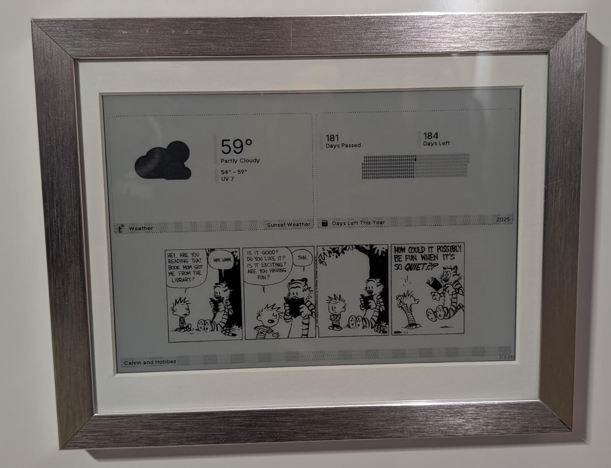
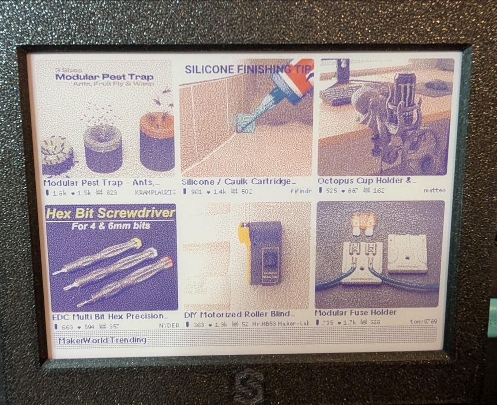
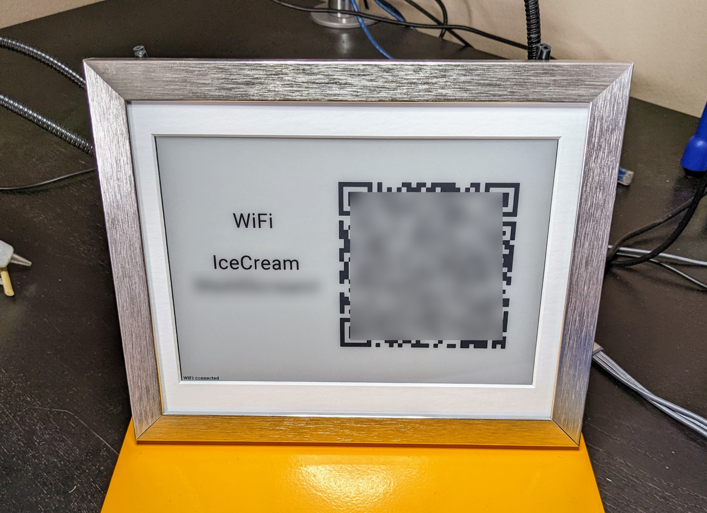
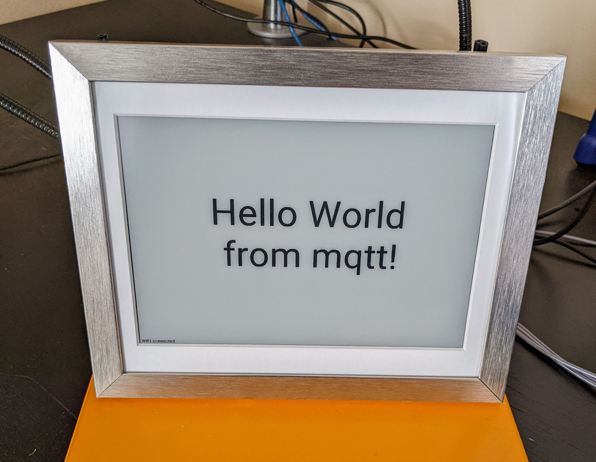
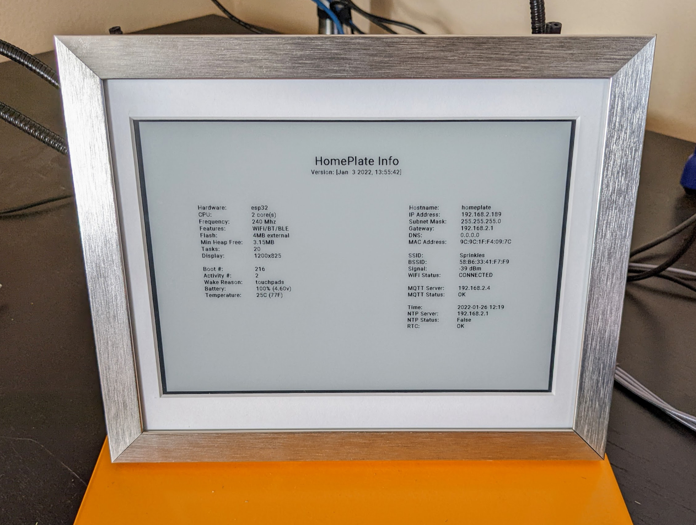

# Activities

## Trmnl Mashup

## Home Assistant Dashboard Screenshot

## Guest WiFi QR Code

## MQTT Text Message

Displayed via the `Display Message` HA action entity, or by publishing a `message` action to `activity/run`. See [hass.md](hass.md#activity-actions-ha-discovery).

## Info Screen

## MQTT Image

Display any image (PNG, JPEG, BMP) from a URL pushed over MQTT. Triggered via the `Display Image URL` HA action entity, or by publishing an `img` action with the URL as `message`. See [hass.md](hass.md#display-an-image-with-dither-override) for the per-image dither override.

## MQTT QR Code

Render any text payload (URL, vCard, plain text) as a QR code, scaled to fit the screen. The QR version is auto-selected, so short text gets a big readable QR and longer text scales down to fit (up to ~2.9KB at ECC_MEDIUM).

Triggered via the `Display QR Code` HA action entity, or by publishing a `qrtext` action to `activity/run` with the text as `message`. (Distinct from the configured Guest Wi-Fi QR — that activity stays on the `qr` action and uses the Wi-Fi SSID/password from the WiFiManager portal.)
